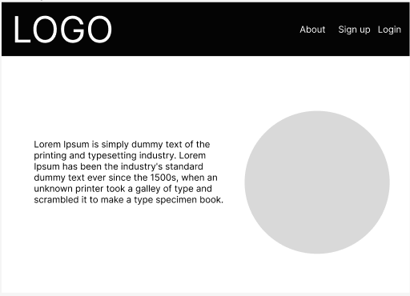
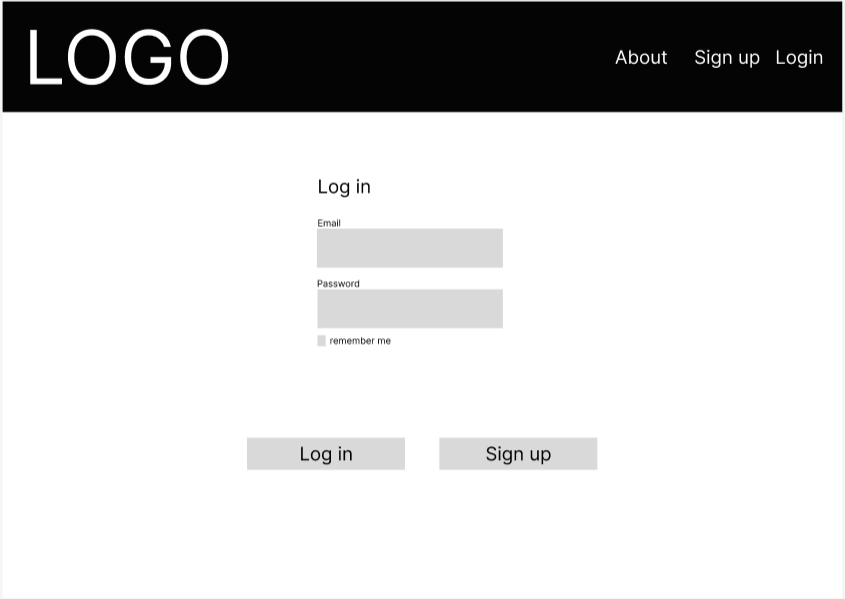
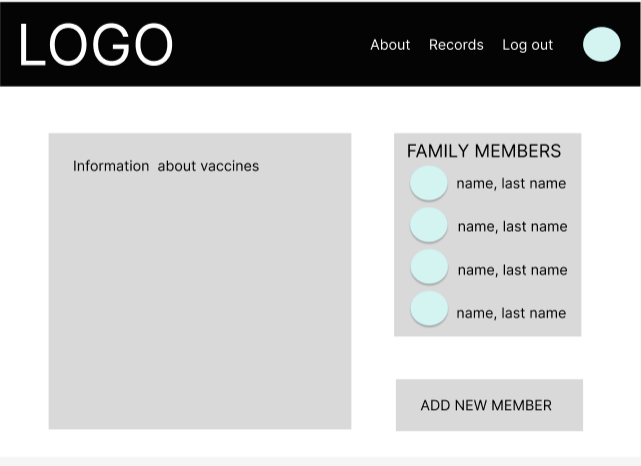
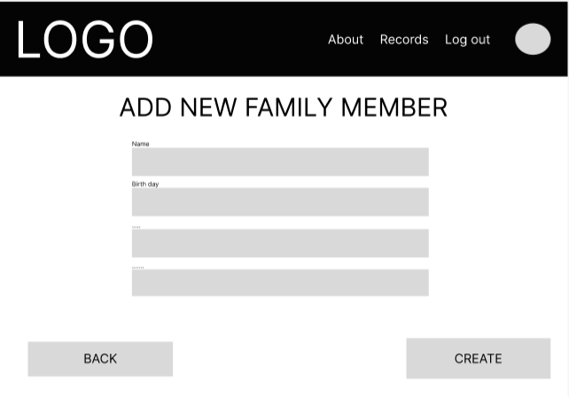
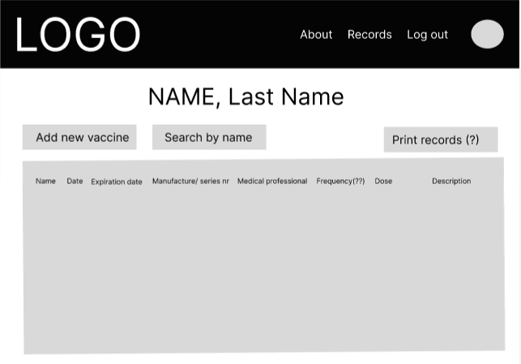
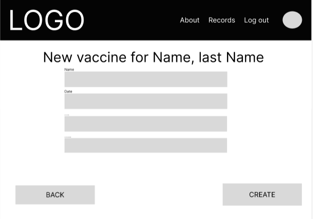

System Description for

# VaxTrack

## Contributors

* Production Management and Back-end: Marky Lyons
* Project Manager: Cherese Dafney
* Font-end: Sachi Patel
* Fullstack: Marina Nambiar
* Fullstack: Agnieszka Krokosz
* Documentation: Laís Bordallo

## App Description<h4>

As part of the GirlDevelopIt Hack4Health 2022 Hackathon, we developed the VaxTrack web application. We wanted to create a simple way to keep track of immunization records. VaxTrack allows users to add, update, and store vaccination records for themselves and their families.

## How to Use the App / FAQ 

xxxxx

## Technology Stack

**MERN Stack**

* MongoDB: non-relational database, ideal for web applications, as it makes queries and returns using JSON.Being utilized in this context to make it possible receive any kind of documentation, from different places, and formats, as a vaccine comprobatory document.
* Express: framework used in the backend that facilitates the creation of REST APIs, managing routes and requests. 
* React: framework used in the frontend, created and used by Facebook, React makes creating the front end much more productive, as it basically uses only Javascript.
* Node.js: best-known Javascript code execution environment on the market.

**Planning and Organization**

* Notion: is an application that provides components such as notes, databases, boards, wikis, calendars and reminders. Users can link these components together to create their own systems for knowledge management, note taking, data management, project management, and more.

* Figma: is a design tool that combines web accessibility with native application functionality.

**Application Planning with Figma Tool**

## Developer Bios