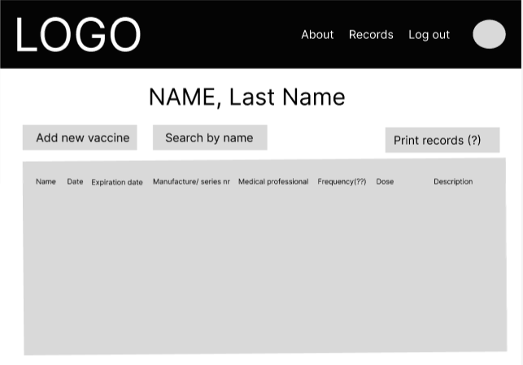

System Description for

# VaxTrack

## Contributors

* Production Management and Back-end: Marky Lyons
* Project Manager: Cherese Dafney
* Font-end: Sachi Patel
* Fullstack: Marina Nambiar
* Fullstack: Agnieszka Krokosz
* Documentation: Laís Bordallo

## App Description<h4>

As part of the GirlDevelopIt Hack4Health 2022 Hackathon, we developed the VaxTrack web application. We wanted to create a simple way to keep track of immunization records. VaxTrack allows users to add, update, and store vaccination records for themselves and their families.

## How to Use the App / FAQ 

xxxxx

## Technology Stack

**MERN Stack**

* MongoDB: non-relational database, ideal for web applications, as it makes queries and returns using JSON.Being utilized in this context to make it possible receive any kind of documentation, from different places, and formats, as a vaccine comprobatory document.
* Express: framework used in the backend that facilitates the creation of REST APIs, managing routes and requests. 
* React: framework used in the frontend, created and used by Facebook, React makes creating the front end much more productive, as it basically uses only Javascript.
* Node.js: best-known Javascript code execution environment on the market.

**Planning and Organization**

* Notion: is an application that provides components such as notes, databases, boards, wikis, calendars and reminders. Users can link these components together to create their own systems for knowledge management, note taking, data management, project management, and more.

* Figma: is a design tool that combines web accessibility with native application functionality.

**Application Planning with Figma Tool**

## Developer Bios

### **Marki Lyons** is an educator who has been learning full-stack web/software development. 
*"Tech connects people with tools and resources they can use to lead fulfilling lives and solve problems. By being in Tech, I can help people by building resources that make their lives better."*

### **Cherese M. Dafney** is a Jr. Project Manager with a passion for merging her interest in Public Health, Project Management & Technology. 
*"What I love about working in tech, specifically global health informatics, is the opportunity to support ideas transition from a thought to a tangible item that can easily be shared across various groups of people in different parts of the world! Boarders can't limit the power of great solutions."*

### **Agnes Krokosz** is a reliable and detail-oriented Software Engineer with 5+ years of experience as a Mechanical Engineer.
*"I was always passionate about technology. Working as a mechanical engineer I collaborated with software developers. I was curious about how they could efficiently solve problems by writing lines of code. After I started learning to code I realized that many skills I gained during my experience as an engineer are very valuable in the software development process. It was a time when I decided to switch my career. Now, after one year I can proudly say that I am Software Developer."*

### **Sachi Patel** is a experienced healthcare professional making a shift into the technology field. I love to problem solve and bring real life solutions to daily concerns.
*"I am in the tech field to hopefully bring life real solutions to everyday problems using tools and advancements constantly coming about in information technology."*

### **Marina Nambiar** is a full stack developer with a background in healthcare. 
*"I love technology's potential to make everyday life and healthcare decisions easier for everyone. I strive to create web applications that are accessible and easy to use."*

### **Laís Bordallo** is a Support Analist who used to study law, now she transitioned to tech and studies Web and Software Development. 
*"I've always been fascinated by technology and all the feats humanity has achieved by using it. COVID happened, and as result created a paradigm shift, bringing with it a shock of reality and humility in many people's lives. I was no exception. During that time, priorities changed, so I reassessed the course of my life. I decided that I should do something I really enjoy with it, because everything passes in the blink of an eye."*